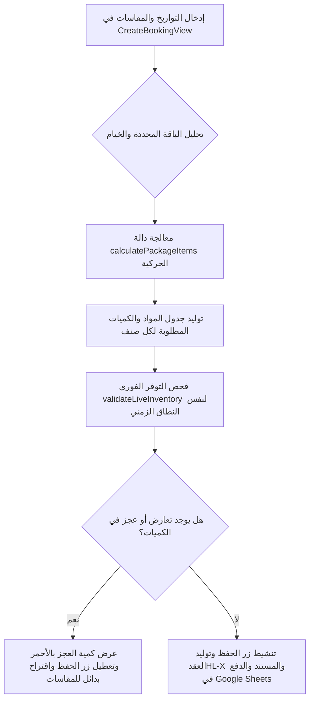

# 🗺️ خريطة المشروع الشاملة لنظام أكرم المتكامل (`PROJECT_MAP.md`)

مرحباً بك في الخريطة الهندسية والتقنية الشاملة لـ **"نظام أكرم المتكامل لإدارة وتنظيم المناسبات والخيام والمخازن"** (Happy Land / Haland System). يهدف هذا المستند إلى توثيق البنية التحتية للنظام، وهيكلية الملفات، وعلاقات قواعد البيانات (Google Sheets)، والعمليات المالية والتشغيلية المتقدمة ليكون مرجعاً تقنياً متكاملاً للمطورين والأنظمة الذكية.

---

## 🏗️ أولاً: البنية البرمجية والتقنيات المستخدمة (System Architecture)

يعتمد النظام على هيكلية حديثة ومدمجة تجمع بين واجهة مستخدم تفاعلية وقاعدة بيانات سحابية سريعة ومنخفضة التكلفة:
1. **الإطار البرمجي (Framework):** [Next.js](https://nextjs.org) (إصدار حديث يعتمد على App Router).
2. **الواجهة الأمامية (Frontend):** React مع تجزئة المكونات إلى شاشات ذكية ومستقلة (Modular Views) مجمعة داخل محاور رئيسية (Hubs) تحت سياق مشترك.
3. **مستوى الحالة والمزامنة (State & Contexts):**
   * `AuthContext`: لإدارة هويات وصلاحيات المستخدمين والمدراء وتأمين المسارات.
   * `AppContext`: لإدارة إتاحة الأصناف، والحجوزات، والتعريفات الأساسية، والمزامنة اللحظية.
   * `ThemeContext`: لإدارة واجهة المستخدم وتجربة المظهر الداكن/المضيء.
   * `PrintContext`: محرك الطباعة الديناميكي لإعداد المستندات والتقارير للمعاينة والطباعة الفورية.
4. **قاعدة البيانات والربط السحابي (Database):** Google Sheets API (v4) عبر حساب خدمة معتمد (`src/lib/google.js`). يتم استخدام الجداول كأوراق عمل (Sheets) مستقلة داخل ملف عمل رئيسي واحد.
5. **التكاملات الخارجية (Integrations):**
    * **مزامنة التقويم الكاملة (Full Calendar Sync):** استيراد وتصدير ملفات ICS بالتوافق مع Google Calendar. يتم مزامنة جميع عمليات الحجوزات (إنشاء، تعديل، دفع، تمديد، إتمام، إلغاء) تلقائياً مع تقويم Google المرتبط (`GOOGLE_CALENDAR_ID`) لضمان تحديث المواعيد والأوصاف والمبالغ المالية في الوقت الفعلي.
   * **معالجة الصور والملفات:** مكتبة `html2canvas` ومحرك `jsPDF` لتوليد مستندات PDF وصور الفواتير وإشعارات القبض لمشاركتها تلقائياً عبر واتساب.

---

## 📂 ثانياً: الهيكل الهرمي للملفات (Directory Structure)

```yaml
D:\tents\
├── .env.local.example       # ملف إعداد البيئة التجريبي (جوجل، التشفير، الصلاحيات)
├── package.json             # ملف الحزم والاعتماديات (Next.js, html2canvas, jspdf, googleapis)
├── next.config.mjs          # إعدادات مترجم وبيئة Next.js
├── docs/                    # ملفات التصميم والتوثيق المرجعي
│   └── design-hubs.md       # مستند هندسة المحاور التشغيلية (Hubs)
├── scripts/                 # نصوص برمجية إدارية مساعدة
│   ├── init-sheets.js       # سكربت تهيئة الجداول وبناء الرؤوس لأول مرة في Google Sheets
│   └── clear_test_data.cjs  # سكربت تنظيف البيانات التجريبية
└── src/
    ├── app/                 # بنية مسارات Next.js (App Router)
    │   ├── page.js          # الصفحة الرئيسية الموجهة تلقائياً لمساحة العمل
    │   │   layout.js        # التخطيط العام وتوزيع سياق البيانات (AppProvider, AuthProvider)
    │   ├── globals.css      # التنسيقات المشتركة والمتغيرات اللونية (Glassmorphism, Dark/Light Mode)
    │   ├── login/           # صفحة تسجيل الدخول والتحقق من الهوية
    │   └── api/             # بوابات الاتصال الخلفية وتعديل البيانات (Back-end API Endpoints)
    │       ├── auth/        # تسجيل الدخول وتوثيق التوكن JWT
    │       ├── bookings/    # محرك الحجوزات (CRUD) + مزامنة التقويم (إنشاء/تعديل/إلغاء/دفع/تمديد/إتمام)
    │       ├── calendar/    # معالج ICS لاستيراد وتصدير فعاليات التقويم وحل التعارضات
    │       ├── finance/     # معالجات الحسابات، قيود اليومية، الحسابات الختامية، والموردين
    │       ├── inventory/   # بوابات الجرد وتحديث المخازن ومراقبة التوفر
    │       └── config/      # معالجات الإعدادات الديناميكية كباقات النظام، مراكز التكلفة، والفروع
    ├── contexts/            # سياقات البيانات المشتركة (Shared State Contexts)
    │   ├── AppContext.jsx   # سياق إدارة التطبيق، الحجوزات، الباقات، والاتصال بالمخزن
    │   ├── AuthContext.jsx  # سياق تأمين الجلسة، الحفظ المحلي للتوكن، وإدارة الصلاحيات
    │   └── ThemeContext.jsx # سياق المظهر وتنسيق الألوان
    ├── hubs/                # المجمعات والمحاور الرئيسية للواجهة
    │   ├── AdminHub.jsx     # محور الإدارة والتعريفات العامة للنظام وبناء الباقات والخيام
    │   ├── FieldHub.jsx     # محور العمليات الميدانية والتحضير والتركيب والإرجاع
    │   ├── FinanceHub.jsx   # محور العمليات المالية وشجرة الحسابات واليومية العامة والأرباح والخسائر
    │   └── InventoryHub.jsx # محور إدارة المخازن والجرد وتلقي وإمداد الأصناف
    ├── lib/                 # المكتبات البرمجية والأدوات المساعدة (Utils & Libs)
    │   ├── auth.js          # خوارزميات توقيع والتحقق من التوكنات JWT وجلب معلومات المستخدم
    │   ├── google.js        # إعداد وبناء اتصال Google APIs بالاعتماد على Service Account
    │   ├── sheets.js        # الدوال الأساسية للقراءة والكتابة والبحث وعمليات الدفعات بداخل الجداول
    │   ├── numberToWords.js # معالج تحويل الأرقام النقدية إلى كلمات باللغة العربية (ريال يمني)
    │   ├── utils.js         # دوال التنسيق المالي، والتاريخي، ومطابقة السلوكيات
    │   └── printEngine/     # المحرك المتقدم للطباعة وإنتاج التقارير والعقود
    │       ├── PrintContext.jsx     # سياق تهيئة الطباعة ونماذج النوافذ المنبثقة والمعاينة
    │       ├── PrintPreviewModal.jsx# شاشة المعاينة قبل الطباعة، وإعدادات حجم الخط، والتحميل والتحويل لـ PDF/صورة
    │       └── layouts/             # قوالب الطباعة المتخصصة
    │           ├── InvoiceLayout.jsx      # قالب فاتورة الحجز وتأكيد العقد الرسمي
    │           ├── SupplierDocLayout.jsx  # قالب مستندات الموردين (فاتورة، تسديد، كشف حساب) بجدول دائن ومدين
    │           ├── ReportTableLayout.jsx  # قالب التقارير والجداول المجمعة والحسابات الختامية
    │           ├── InventoryListLayout.jsx# قالب قوائم الجرد والأصناف
    │           ├── FieldItemsLayout.jsx   # قالب قوائم التحميل والتوزيع الميداني
    │           └── TransferItemsLayout.jsx# قالب طلبات ومستندات تحويل الأصناف بين المخازن
    └── views/               # شاشات الواجهة التفصيلية المدمجة بداخل المحاور (Modular Tabs)
        ├── DashboardView.jsx# شاشة الإحصائيات السريعة ومراقبة المبيعات وتدفق السيولة والديون
        ├── QueryView.jsx    # شاشة البحث الذكي، كشوف حسابات العملاء، العمليات المالية للحجز، والإلغاء
        ├── CreateBookingView.jsx# شاشة حجز جديد تفاعلية وصياغة العقود وتخصيص الباقات
        ├── CalendarView.jsx # شاشة التقويم التفاعلية للصالات والمواقع وإدارة روابط ICS
        ├── SuppliersView.jsx# شاشة الحسابات والموردين والترحيل المحاسبي (Rollover) وإشعارات الواتساب
        ├── InventoryView.jsx# شاشة رصد مستويات المخزن، الإضافة اليدوية، والتحويل
        ├── ExpensesView.jsx # شاشة قيود المصروفات المباشرة والتشغيلية المنسوبة لمراكز تكلفة وفروع
        ├── ProfitLossView.jsx# شاشة القوائم المالية والأرباح والخسائر والميزان العمومي
        └── FieldOpsView.jsx # شاشة مراقبة المهام الميدانية (قيد التحضير، أثناء التركيب، مكتمل ومسترجع)
```

---

## 💾 ثالثاً: هيكلية البيانات وتوصيف الجداول (Google Sheets Schema)

يعتمد النظام على هيكلية مرنة تعتمد على محاكاة العلاقات بين جداول البيانات لضمان كفاءة عالية وتجنب تكرار البيانات:

### 1. جدول الحجوزات (`Bookings`)
يخزن السجلات الأساسية للحجوزات المبرمة مع العملاء.
* **الأعمدة الأساسية:**
  * `bookingId` (العمود A): المعرّف الفريد لكل حجز (يبدأ بـ HL-).
  * `customerName` (العمود B): اسم العميل بالكامل.
  * `customerPhone` (العمود C): رقم تواصل العميل (يتم تعديله آلياً لتهيئة واتساب).
  * `startDate` (العمود D) & `endDate` (العمود E): التواريخ المحددة للحجز بصيغة `YYYY-MM-DD`.
  * `totalAmount` (العمود F): إجمالي قيمة العقد قبل الدفعات.
  * `paidAmount` (العمود G): إجمالي المبالغ المدفوعة مقدمات ودفعات لاحقة.
  * `remainingAmount` (العمود H): القيمة المتبقية من العقد (تعديل آلي: الإجمالي - المدفوع).
  * `status` (العمود I): حالة الحجز الحالية (`مؤكد` | `قيد الانتظار` | `مكتمل` | `منتهي` | `ملغي`).
  * `bookingType` (العمود L): تصنيف الحجز ماليًا وتشغيليًا (`صالة` | `خيام وباقات` | `تأجير مفردات`).
  * `packageUsed` (العمود M): اسم الباقة في حال الخيام وباقات الخيام.
  * `notes` (العمود N): ملاحظات إدارية وتشغيلية عامة.
  * `shift` (العمود Q): فترة الفعالية (`صباحي` | `مسائي` | `يوم كامل`).
  * `tentWidth` (العمود R) & `tentLength` (العمود S) & `tentCount` (العمود T): الأبعاد التقنية لتركيب الخيام والعدد الميداني المطلوب.
  * `customerIdNumber` (العمود AC): رقم الهوية الوطنية/جواز السفر للعميل.
  * `customerAddress` (العمود AE): العنوان الجغرافي للعميل لغرض التركيب أو الفوترة.

### 2. جدول الأصناف المستأجرة (`Rented_Items`)
يخزن ارتباط المواد المفردة والكميات بالحجوزات، وهو محرك حل العجز والمخزون الحي.
* **الأعمدة الأساسية:**
  * `id` (العمود A): المعرّف الفريد للسطر.
  * `bookingId` (العمود B): كود الحجز المرتبط بالمواد.
  * `itemId` (العمود C): معرّف الصنف الفريد من جدول المخزن.
  * `quantityRequested` (العمود D): الكمية المطلوبة للموقع مخصصة للباقة أو مضافة يدوياً.
  * `unitPrice` (العمود E): سعر تأجير القطعة/الصنف المنفصل.

### 3. جدول حركة المخازن والجرد (`Inventory_Stock` & `Inventory_Transactions`)
لمراقبة توفر المواد والكمية الاستباقية للخيام والمناسبات المتعددة.
* **الأعمدة الأساسية:**
  * `itemId`: كود الصنف الفريد.
  * `itemName`: الاسم التعريفي للصنف (مثل: بوايك، سقوف شيفون، كراسي ملكية، فرش).
  * `initialQty`: الكمية الافتتاحية الإجمالية المملوكة للمشروع.
  * `reservedQty`: كميات محجوزة ضمن تواريخ تتقاطع تشغيلياً مع حجوزات قيد التنفيذ (تُحسب بالمعادلة الفورية).

### 4. جدول الموردين وحسابات التوريد (`Suppliers` & `Supplier_Purchases` & `Transactions`)
المسؤول عن توثيق ديون المشتريات المباشرة، وحالات ترحيل الفواتير، والمسددات.
* **الأعمدة في جدول الفواتير والتوريد (`Supplier_Purchases`):**
  * `purchaseId` (العمود A): معرّف فاتورة الشراء والتوريد (تبدأ بـ PUR-).
  * `supplierId` (العمود B): كود المورد الفريد.
  * `totalAmount` (العمود F): إجمالي الفاتورة شامل الترحيلات السابقة إن وجدت.
  * `carriedAmount` (العمود M): المبلغ المرحل والمسحوب من الفواتير السابقة المغلقة لبيان رصيد الفاتورة التراكمي وتتبع الذمم.
  * `status` (العمود I): حالة الفاتورة (`open` | `paid` | `carried` | `cancelled`). تبقى الفاتورة مفتوحة (`open`) لمراقبة سداد القيمة الإجمالية (الرصيد الجديد + المرحل) ولا تُغلق إلا بالسداد الكامل أو ترحيل المتبقي لفاتورة جديدة مجمعة لضمان سلامة الدورة المحاسبية.

---

## 🔗 رابعاً: آليات وسياق العمليات المتقدمة (Core Operations Flow)

### 1. دورة حجز العقد الذكي وصيانة المخزون (Smart Booking & Live Inventory)


### 2. دورة الترحيل المحاسبي المتتالي للموردين (Supplier Rollover Accounting)
صُمم هذا النظام لضمان عدم ضياع المستحقات التراكمية للموردين وعرض تتابع الذمم بطريقة منطقية ودقيقة:
* **تسجيل المشتريات:** عند تسجيل فاتورة توريد جديدة للمورد، يعرض النظام الفواتير المتبقية السابقة (المفتوحة)، ويمنح الموظف ميزة ترحيل أرصدتها المتبقية بالكامل آلياً وإدراجها كسطر مرحل في الفاتورة الجديدة في العمود M (`carriedAmount`).
* **الدفع والسداد الموجه:** يتم توجيه المدفوعات آلياً لتسوية المبالغ التراكمية، ولا تخرج الفاتورة من التداول وتصنف كـ `paid` إلا بعد سداد القيمة الإجمالية (المبلغ الجديد + المبالغ المرحَّلة من الفواتير السابقة)، مما يمنع تكدس ديون مخفية ويسمح بطباعة إشعار مالي وكشف حساب دقيق يوضح تتابع العمليات.

### 3. محرك الطباعة والتحويل والمشاركة الذكية (PDF/Image and Share Engine)
* **المعاينة الفورية والطباعة:** يولد كشافات ومعاينات في منتهى الاحترافية والجمالية مع إمكانيات تغيير حجم الخط (صغير جداً، عادي، كبير) وملاءمة القالب لثلاثة نماذج رئيسية:
  * `A4`: ورقة كاملة مطبوعة بمرونة.
  * `A5`: نصف ورقة للتسليمات السريعة والمستندات المخازنية الميدانية.
  * `thermal`: الإيصالات الحرارية لمسددي الدفعات السريعة والمقدمات.
* **تخطي مشاكل قص الشاشة (html2canvas Cropping Fix):** تم حل مشاكل قص المستندات عند التصدير لصور أو ملفات PDF عن طريق سياق تثبيت مؤقت للعنصر المراد تصويره وسط الشاشة بتموضع ثابت (`position: fixed`) وبشفافية صفرية ليكون مرئياً بالكامل لمحرك التوليد مع إجبار الحاوية الطولية على إبداء كامل امتدادها الطبيعي، ثم إعادة الهيكلية للتصميم الأصلي فوراً بعد إتمام التنزيل، مما يضمن دقة المستند بنسبة 100%.

### 4. مزامنة التقويم التلقائي لجميع عمليات الحجز (Full Calendar Lifecycle Sync)

يضمن النظام مزامنة كل تغيير يطرأ على الحجز مع تقويم Google المرتبط (`GOOGLE_CALENDAR_ID`) بشكل فوري:

| العملية | الملف المسؤول | إجراء التقويم |
|---------|---------------|---------------|
| **إنشاء حجز** (`POST`) | `bookings/route.js:349-380` | إنشاء حدث جديد مع الحالة = `مؤكد`، والوصف يحتوي على كامل تفاصيل الحجز والعملاء والمواعيد والمبالغ |
| **تعديل حجز** (`PUT`) | `bookings/route.js:742-787` | البحث عن الحدث الحالي عبر `privateExtendedProperty: bookingId`، ثم تحديث كامل بياناته (تاريخ، مبلغ، وصف، ملخص) |
| **تسجيل دفعة** (`PATCH /payment`) | `payment/route.js:103-125` | تحديث وصف الحدث الموجود: تعديل `المبلغ المقدم` و `المتبقي` بالقيم الجديدة (بدون تغيير التواريخ) |
| **تمديد حجز** (`POST /extend`) | `extend/route.js:145-167` | تحديث تاريخ النهاية (`end`) للحدث وإضافة سطر `[تم التمديد إلى YYYY-MM-DD]` في الوصف |
| **إلغاء حجز** (`PATCH /cancel`) | `cancel/route.js:62-84` | حذف الحدث من التقويم (يبقى سجل الحجز في الشيت كملغي) |

**آلية الربط:** يُستخدم `bookingId` كمعرّف مشترك—يُخزّن في `extendedProperties.private.bookingId` عند إنشاء الحدث، ويُستخدم للبحث عند التحديث أو الحذف.

**معالجة الأخطاء:** جميع عمليات التقويم محاطة بـ `try/catch` مع `console.error` فقط—لا تُفشل العملية الرئيسية أبداً إذا فشل التقويم.

---

## 🎯 خامساً: إرشادات صيانة وتطوير النظام (Developer Guidelines)

لتسهيل المهمة على المطورين والأنظمة الذكية والالتزام التام بالمعايير الحالية للمشروع:
1. **مراعاة الصلاحيات والتحقق:** دائماً استخدم حراسة التوكن السليمة في الواجهة الخلفية عن طريق `requireAuth` والتحقق من `auth.user` بشكل صارم للتأمين وتتبع منفذي العمليات.
2. **سياق اللغات والمصطلحات الدارجة:** الواجهة مصممة كلياً باللغة العربية. استخدم المصطلحات المالية والتشغيلية المعتمدة في الملفات مثل (علينا، لنا، دائن، مدين، المسدد منا، ترحيل، سند صرف، سند قبض).
3. **مزامنة التقويم الشامل:** جميع عمليات الحجز (إنشاء، تعديل، دفع، تمديد، إتمام، إلغاء) تُزامن تلقائياً مع تقويم Google عبر `CALENDAR_ID`. عند إضافة مسار جديد يعدّل الحجز، تأكد من إضافة مزامنة التقويم بنفس النمط: البحث عبر `privateExtendedProperty: bookingId` ثم التحديث أو الحذف.
4. **التحقق المالي المزدوج:** لا تسمح أبداً بتسجيل حجوزات أو تعديلها بمبالغ مدفوعة تفوق إجمالي العقد، أو مبالغ إجمالية سالبة، لضمان صحة القيود المحاسبية التلقائية وحماية الصناديق والخزائن.

---
إن نظام **أكرم المتكامل** يمثل منصة متماسكة وقوية للجمع بين الكفاءة الميدانية والدقة المحاسبية، ومتابعة هذا الدليل يضمن استمرار تطوره بالاستقرار والسرعة المنشودين!
